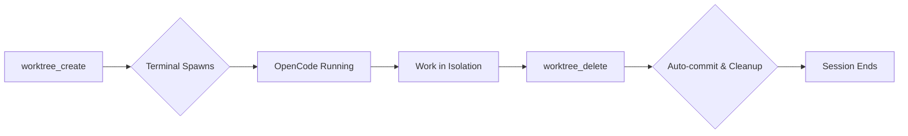
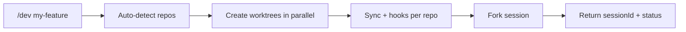

# opencode-worktree

[](https://www.npmjs.com/package/@nevermore93/opencode-worktree)

> Git worktrees that spawn their own terminal. Multi-repo workspaces that orchestrate themselves. Zero-friction isolation for AI-driven development.

An [OpenCode](https://github.com/sst/opencode) plugin that creates isolated git worktrees—single-repo with automatic terminal spawning, or multi-repo workspaces that mirror your directory layout. No manual setup, no context switching, no cleanup work.

## Why This Exists

You already know you can create git worktrees manually. Or use OpenCode Desktop's UI. So why this plugin?

Manual worktrees require setup: create the worktree, open a terminal, navigate to it, start OpenCode. OpenCode Desktop gives you worktrees, but locks you into the GUI workflow. Each approach has friction.

This plugin eliminates that friction. When the AI calls `worktree_create`, your terminal spawns automatically, OpenCode is already running, and files are synchronized. When it calls `worktree_delete`, changes commit automatically and the worktree cleans itself up. For multi-repo setups, `/dev my-feature` creates parallel worktrees across all detected repos, syncs and hooks each one, then returns a session ID for the caller to connect however it chooses. It's the difference between having a tool and having a workflow.

Works great standalone, but pairs especially well with **[cmux](https://www.cmux.dev/)** for agentic workflows. cmux provides native workspace management and programmatic control that fits naturally into automated development workflows. tmux is also supported if you prefer a traditional multiplexer setup.

## When to Use This

| Approach | Best For | Tradeoffs |
|----------|----------|-----------|
| **Manual git worktree** | One-off experiments, full control | Manual setup, no auto-cleanup, context switching |
| **OpenCode Desktop UI** | Visual workflow, integrated experience | Tied to desktop app, less automation |
| **This plugin** | AI-driven workflows, automation, CLI-first users | Adds plugin dependency to your project |

If you prefer manual control or work exclusively in OpenCode Desktop, you may not need this. **But if you want AI agents to seamlessly create and manage isolated development sessions—complete with automatic terminal spawning and state cleanup—this is what you're looking for.**

## How It Works

### Single-Repo Worktrees



1. **Create** — AI calls `worktree_create("feature/dark-mode")`
2. **Terminal spawns** — New window opens with OpenCode at `~/.local/share/opencode/worktree/<project-id>/feature/dark-mode`
3. **Work** — AI experiments in complete isolation
4. **Delete** — AI calls `worktree_delete("reason")`
5. **Cleanup** — Changes commit automatically, git worktree removed

Single-repo worktrees are stored in `~/.local/share/opencode/worktree/<project-id>/<branch>/` outside your repository.

### Multi-Repo Workspaces



1. **Create** — User runs `/dev my-feature` or AI calls `worktree_workspace_create("my-feature")`
2. **Detect** — Scans direct subdirectories of cwd for git repos
3. **Worktrees** — Creates one worktree per repo at `<cwd>/../worktrees/my-feature/<repo>/`
4. **Session** — Forks a single workspace-level session; returns `sessionId`
5. **Reconcile** — Re-running the same command reuses healthy worktrees and retries failed ones

## Installation

```bash
ocx add kdco/worktree --from https://registry.kdco.dev
```

If you don't have OCX installed, install it from the [OCX repository](https://github.com/kdcokenny/ocx).

**Optional:** Install `kdco-workspace` for the full experience—it bundles worktrees with background agents, planning tools, and notifications:

```bash
ocx add kdco/workspace --from https://registry.kdco.dev
```

## Usage

The plugin provides three tools:

| Tool | Purpose |
|------|---------|
| `worktree_create(branch, baseBranch?)` | Create a single-repo git worktree with automatic terminal spawning. |
| `worktree_delete(reason)` | Delete the current worktree. Changes commit automatically before removal. |
| `worktree_workspace_create(name)` | Create a multi-repo workspace with mirrored worktrees. Headless — no terminal spawned. |

### Creating a Single-Repo Worktree

```yaml
worktree_create:
  branch: "feature/dark-mode"
  baseBranch: "main"  # optional, defaults to HEAD
```

When called, this:
1. Creates git worktree at `~/.local/share/opencode/worktree/<project-id>/feature/dark-mode`
2. Syncs files based on `.opencode/worktree.jsonc` config
3. Runs post-create hooks (e.g., `pnpm install`)
4. Forks the current session and opens a new terminal with OpenCode running

### Deleting a Worktree

```yaml
worktree_delete:
  reason: "Feature complete, merging to main"
```

When called, this:
1. Runs pre-delete hooks (e.g., `docker compose down`)
2. Commits all changes with snapshot message
3. Removes git worktree with `--force`
4. Cleans up session state

### Creating a Multi-Repo Workspace

For monorepo-like setups where multiple git repositories live under a single parent directory, use the workspace tool:

```yaml
worktree_workspace_create:
  name: "my-feature"
```

Or via the `/dev` slash command:

```
/dev my-feature
```

When called, this:
1. Auto-detects all git repositories in the current directory
2. Creates worktrees under `<cwd>/../worktrees/<name>/` — one per repo
3. Computes branch names as `dev_{baseBranch}_{name}_{YYMMDD}` (e.g., `dev_main_my-feature_260415`)
4. Runs per-repo sync (copyFiles, symlinkDirs) and postCreate hooks in parallel
5. Forks a single workspace-level session
6. Returns a structured result — no terminal is opened

**Headless by design:** The workspace tool returns a `sessionId` and per-repo status. The caller (AI agent, slash command, or script) decides how to connect — via `opencode session attach`, a new terminal, or programmatic control.

**Reconcile on re-run:** Running `/dev my-feature` again reconciles rather than rebuilds. Healthy worktrees are reused, missing or failed ones are recreated.

#### Response Shape

```json
{
  "workspacePath": "/home/user/worktrees/my-feature",
  "sessionId": "sess_abc123",
  "sessionDisposition": "forked",
  "repos": [
    { "repoName": "frontend", "worktreePath": "/home/user/worktrees/my-feature/frontend", "branch": "dev_main_my-feature_260415", "status": "created" },
    { "repoName": "backend", "worktreePath": "/home/user/worktrees/my-feature/backend", "branch": "dev_main_my-feature_260415", "status": "created" }
  ],
  "warnings": []
}
```

Possible `status` values per repo: `created`, `reused`, `retried`, `failed`.

`sessionDisposition` is either `"forked"` (new session) or `"reused"` (existing session found from a previous run).

## Platform Support

The plugin detects your terminal automatically:

| Platform | Terminals Supported |
|----------|---------------------|
| **macOS** | Ghostty, iTerm2, Kitty, WezTerm, Alacritty, Warp, Terminal.app |
| **Linux** | Kitty, WezTerm, Alacritty, Ghostty, Foot, GNOME Terminal, Konsole, XFCE4 Terminal, xterm |
| **Windows** | Windows Terminal (wt.exe), cmd.exe fallback |
| **cmux** | **Uses native cmux workflow** when `CMUX_WORKSPACE_ID` is present or socket control is explicitly enabled (`CMUX_SOCKET_PATH` + `CMUX_SOCKET_MODE=allowAll`); each worktree launch opens a new cmux workspace and falls back safely when unavailable |
| **tmux** | Creates new tmux window (supported on all platforms) |
| **WSL** | Windows Terminal via wt.exe interop |

### Detection Priority

1. **tmux** - Runtime priority on all platforms when already inside tmux. Creates new tmux windows instead of spawning separate terminal applications.
2. **cmux** - **Recommended for new agentic workflows**. Uses native cmux launch flow when available via `CMUX_WORKSPACE_ID` or explicit socket control (`CMUX_SOCKET_PATH` with `CMUX_SOCKET_MODE=allowAll`). Worktree launches always create a new cmux workspace (no current-workspace reuse), then fall back safely when cmux context is unavailable.
3. **WSL** - Uses Windows Terminal for Linux subsystem
4. **Environment vars** - Checks `TERM_PROGRAM`, `KITTY_WINDOW_ID`, `GHOSTTY_RESOURCES_DIR`, etc.
5. **Fallback** - System defaults (Terminal.app, xterm, cmd.exe)

## Configuration

Auto-creates `.opencode/worktree.jsonc` on first use:

```jsonc
{
  "$schema": "https://registry.kdco.dev/schemas/worktree.json",

  // This config applies to both worktree_create and workspace mode.
  // In workspace mode, each repo loads its own .opencode/worktree.jsonc.

  "sync": {
    // Files to copy from main worktree
    "copyFiles": [],

    // Directories to symlink
    "symlinkDirs": [],

    // Patterns to exclude
    "exclude": []
  },

  "hooks": {
    // Run after creation (in workspace mode, hooks run in parallel across repos)
    "postCreate": [],

    // Run before deletion (single-repo only)
    "preDelete": [],

    // Timeout per hook command in ms (default: 1800000 = 30 min, 0 = no timeout)
    // "timeout": 1800000
  }
}
```

### Common Configurations

**Node.js project:**
```jsonc
{
  "sync": {
    "copyFiles": [".env", ".env.local"],
    "symlinkDirs": ["node_modules"]
  },
  "hooks": {
    "postCreate": ["pnpm install"]
  }
}
```

**Docker-based project:**
```jsonc
{
  "sync": {
    "copyFiles": [".env"]
  },
  "hooks": {
    "postCreate": ["docker compose up -d"],
    "preDelete": ["docker compose down"]
  }
}
```

## FAQ

### Why not just use git worktree manually?

Manual worktrees require manual setup: `git worktree add`, opening a terminal, navigating to it, starting OpenCode. Each step is friction. This plugin gives you a single command that handles everything end-to-end, complete with automatic file synchronization and lifecycle hooks.

### Does this work with OpenCode Desktop?

Worktrees created with this plugin work fine in OpenCode Desktop, but you lose the automatic terminal spawning. The plugin's value is in CLI-first workflows and AI automation—if you prefer Desktop exclusively, you may not need this.

### What happens if I forget to delete the worktree?

Changes remain in `~/.local/share/opencode/worktree/<project-id>/<branch>`. The branch exists in git. You can manually check out or delete it later. The plugin doesn't force cleanup—it's just the convenient default path.

### Can I have multiple worktrees simultaneously?

Yes. Each gets its own terminal and OpenCode session. They're fully independent.

### Does this break my existing git workflow?

No. It uses standard git worktrees. `git worktree list` shows them. Branches merge normally.

### Why spawn a new terminal instead of reusing the current one?

Isolation. You can close the worktree session without affecting your main workflow. If the AI breaks something, your original terminal remains untouched.

## Limitations

### Security

- Branch names validated against git ref rules and shell metacharacters
- File sync paths validated to prevent directory traversal
- Hook commands run with user privileges in worktree directory

### Terminal Spawning

- Ghostty on macOS uses inline commands to avoid permission dialogs
- Kitty tab support requires `allow_remote_control` config (falls back to window)
- Some terminals don't support tabs; opens new OS window instead

## Manual Installation

Copy [`src/`](./src) to `.opencode/plugin/`. You lose OCX's dependency management and automatic updates.

**Requirements:**
- Manually install `jsonc-parser`
- Manual updates via re-copying

## Part of the OCX Ecosystem

From the [KDCO Registry](https://github.com/kdcokenny/ocx/tree/main/registry/src/kdco). Combine with:

- [opencode-workspace](https://github.com/kdcokenny/opencode-workspace) - Structured planning with rule injection
- [opencode-background-agents](https://github.com/kdcokenny/opencode-background-agents) - Async delegation with persistent outputs
- [opencode-notify](https://github.com/kdcokenny/opencode-notify) - Native OS notifications

## Acknowledgments

Inspired by [opencode-worktree-session](https://github.com/felixAnhalt/opencode-worktree-session) by Felix Anhalt.

## Contributing

This facade is maintained from the main [OCX monorepo](https://github.com/kdcokenny/ocx).

If you want to update opencode-worktree itself, start here:

- https://github.com/kdcokenny/ocx/blob/main/workers/kdco-registry/files/plugins/worktree.ts
- https://github.com/kdcokenny/ocx/tree/main/workers/kdco-registry/files/plugins/worktree

- Open issues here: https://github.com/kdcokenny/ocx/issues/new
- Open pull requests here: https://github.com/kdcokenny/ocx/compare
- Please do **not** open issues or PRs in this facade repository.

## Disclaimer

This project is not built by the OpenCode team and is not affiliated with [OpenCode](https://github.com/sst/opencode) in any way.

## License

MIT
