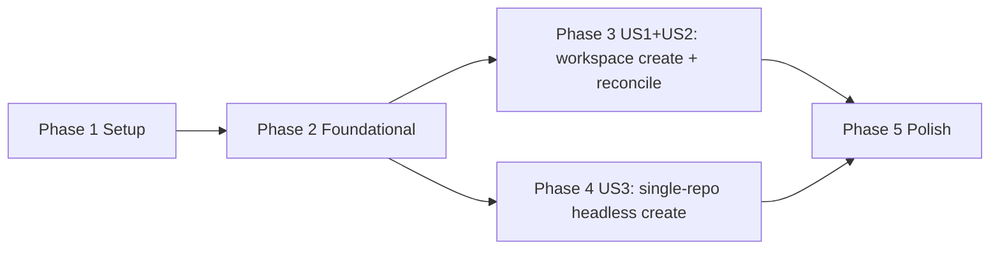

---

description: "Implementation tasks for workspace-level worktree orchestration"
---

# Tasks: Workspace-Level Worktree Orchestration

*Aligned with spec.md, 2026-04-17.*

**Input**: Design documents from `/specs/001-workspace-worktree-orchestration/`
**Prerequisites**: spec.md, `checklists/requirements.md`

**Tests**: No explicit test tasks are included because the current specification does not require TDD or dedicated automated test work for this feature.

**Organization**: Tasks are grouped by user story so each story can be implemented and validated as an independent increment. User story numbers match spec.md exactly.

## Format: `[ID] [P?] [Story] Description`

- **[P]**: Can run in parallel (different files, no dependency on incomplete tasks)
- **[Story]**: Which user story this task belongs to (`US1`, `US2`, `US3`)
- Include exact file paths in every task description

## Path Conventions

- Plugin entrypoint: `src/plugin/worktree.ts`
- Worktree support modules: `src/plugin/worktree/`
- Shared primitives: `src/plugin/kdco-primitives/`

## Phase 1: Setup (Shared Infrastructure)

**Purpose**: Extract the current single-file implementation into reusable modules that later stories can build on.

- [x] T001 [P] Extract worktree config schema/loading defaults from `src/plugin/worktree.ts` into `src/plugin/worktree/config.ts`
- [x] T002 [P] Extract git/worktree command helpers from `src/plugin/worktree.ts` into `src/plugin/worktree/git.ts`
- [x] T003 [P] Extract sync and hook helper surface from `src/plugin/worktree.ts` into `src/plugin/worktree/sync.ts`

---

## Phase 2: Foundational (Blocking Prerequisites)

**Purpose**: Create the shared persistence, validation, and session abstractions required by every story.

**Critical**: No user story work should begin until this phase is complete.

- [x] T004 Expand pooled database lifecycle in `src/plugin/worktree/state.ts` to replace the current module-level singleton across multiple project roots
- [x] T005 Add workspace association, workspace member, and workspace-session binding tables plus CRUD APIs in `src/plugin/worktree/state.ts` (per-project DB only; no global workspace registry)
- [x] T006 [P] Create shared workspace/session helper surface in `src/plugin/worktree/workspace-session.ts`
- [x] T007 Update `src/plugin/worktree.ts` to consume the extracted config, git, sync, state, and session modules while preserving current single-repo behavior

**Checkpoint**: Shared infrastructure is ready for workspace orchestration and headless flows.

---

## Phase 3: User Story 1 — Create Multi-Repo Workspace with `/dev <name>` (Priority: P1)

**Spec reference**: User Story 1 + User Story 2 (reconcile). Both stories share the same implementation path since re-running `/dev <name>` is inherently a reconcile operation.

**Goal**: Auto-detect repos, create or reconcile a mirrored multi-repo workspace, fork or reuse exactly one workspace session, and return normalized per-repo outcomes.

**Independent Test**: Run `/dev prd_1` from a directory containing two repos; verify mirrored worktrees exist on the expected branches, the response includes a forked session ID, per-repo statuses use `{created, reused, retried, failed}`, and no terminal window opens.

- [x] T008 [P] [US1] **[已对齐 2026-04-19]** Implement `/dev <name>` argument validation (pattern `^[a-zA-Z0-9][a-zA-Z0-9_-]{0,63}$`) and auto-detect git repos among direct subdirectories of `<cwd>` in `src/plugin/worktree/workspace.ts`. Additionally validate that `<name>` does NOT collide with: (a) OpenCode built-in slash commands (`init`, `review` per OpenCode `command/index.ts:60-63`), (b) existing `.opencode/commands/<name>.md` files (excluding `dev.md` which FR-024 auto-creates). Conflict MUST surface as a clear validation error before any worktree mutation or FR-024 auto-create. **Implemented**: `validateWorkspaceName()` (regex) + `checkWorkspaceNameAvailable()` (async namespace check) in `workspace.ts`; called as Step 1+1b in `orchestrateWorkspaceCreate`.
- [x] T009 [P] [US1] Implement target workspace path resolution (`<cwd>/../worktrees/<name>/`), nesting rejection, compatibility checks, and per-target locking in `src/plugin/worktree/workspace.ts`
- [x] T010 [P] [US1] Implement workspace-session fork, reuse, and stale-binding rebind logic (always headless — no terminal spawn) in `src/plugin/worktree/workspace-session.ts`
- [x] T011 [US1] **[已对齐 2026-04-19]** Implement two-path pre-check (FR-009) in `src/plugin/worktree/workspace-create.ts`: (a) **confirmed branch collision** — target branch already checked out by live worktree at a path outside the target workspace → reject ENTIRE command before any `git worktree add`; error MUST name the conflicting repo, branch, and external worktree path. (b) **pre-check failure on a single repo** — `git worktree list` errors, lock held, transient I/O — that single repo MUST be marked `status="failed"` with descriptive `error`, others continue both pre-check AND subsequent execution. Whole-command reject is reserved EXCLUSIVELY for case (a). **Implemented**: `checkBranchCollisions()` returns `PreCheckOutcome { collisions, preCheckFailures }`; orchestrator handles both paths (collisions → reject, failures → synthesize per-repo `MemberOutcome` with `status="failed"` and exclude from `executeWorktreeCreation` plansToExecute).
- [x] T012 [US1] **[已对齐 2026-04-19]** Implement per-repo reconcile planning and normalized status classification (`created`, `reused`, `retried`, `failed`) in `src/plugin/worktree/workspace-create.ts`. Include: `git fetch` per repo (failures = warnings, non-fatal), branch name computation per FR-005 (`dev_{base_branch}_{name}_{YYMMDD}`; `base_branch` = local short name from `git rev-parse --abbrev-ref HEAD` with **NO remote prefix** and **NO `/` substitution** — preserve `/` as-is in branch refs; detached HEAD → first 12 hex chars of commit SHA via `git rev-parse --short=12`), stored branch reuse on re-run (no date re-rolling), healthy worktree detection (FR-022: dir exists + `.git` entry + `git worktree list`), orphan worktree cleanup (FR-007), ghost metadata auto-prune + retry (FR-008). **Implemented 2026-04-19**: removed `replace(/\//g, "-")` sanitisation; changed `--short=8` → `--short=12`; updated docstring.
- [x] T013 [US1] **[需复审 2026-04-17]** Implement parallel worktree creation across repos with per-repo sync (`copyFiles`, `symlinkDirs`) and `postCreate` hook execution with configurable timeout (default 30 min) in `src/plugin/worktree/workspace-create.ts`. Per FR-023 partial-rollback semantics: per-repo failures (worktree-add error, sync failure, hook timeout) MUST mark the affected repo `status="failed"` with mandatory `error` field (FR-019); MUST NOT abort the parallel phase; MUST NOT block subsequent steps (session fork + DB writes) for successful repos.
- [x] T014 [US1] **[需复审 2026-04-17]** Persist workspace association/member outcomes and `sessionDisposition` in `src/plugin/worktree/state.ts` and `src/plugin/worktree/workspace-create.ts`. Strict FR-023 ordering: (1) pre-check (T011), (2) parallel create+sync+hooks with non-blocking failures (T013), (3) session fork or reuse (T010), (4) write WorkspaceMember records to per-project DB **ONLY for successful repos** after step 3 succeeds. If session fork itself fails, NO member records are written for any repo (FR-015 applies — worktrees retained on disk for next reconcile).
- [x] T015 [US1] **[需复审 2026-04-17]** Add the `worktree_workspace_create` AI tool contract with orchestration wiring in `src/plugin/worktree.ts`. Response shape per FR-019: `{ workspacePath, sessionId, sessionDisposition, repos[{ name, worktreePath, branch, status, error? }], warnings[] }` where `error` is a human-readable string that MUST be present whenever `status="failed"`. Partial-success responses (some repos `failed`) MUST still return the workspace `sessionId` and a complete `repos` array. Per FR-016, `warnings[]` MUST list root-level files in the target directory not managed by the plugin. Per FR-024, `/dev <name>` slash command is provided via `.opencode/commands/dev.md` (auto-created by T024) — the AI tool and slash command are MVP-equivalent surfaces.
- [x] T016 [US1] Handle fork-session failure after worktrees created: retain worktrees on disk, do not write member records, return error describing retained worktrees (FR-015)
- [x] T024 [US1] **[Implemented 2026-04-19]** Implement `.opencode/commands/dev.md` auto-create for FR-024. Add a new module `src/plugin/worktree/dev-command.ts` (or extend `src/plugin/worktree/config.ts`) exporting `ensureDevCommand(directory: string, log: Logger): Promise<void>`. Behavior: on plugin activation (same call site as the existing `loadWorktreeConfig` auto-create), check whether `<directory>/.opencode/commands/dev.md` exists; if absent, write the following 2-line markdown:

  ```markdown
  ---
  description: Create or reconcile a multi-repo workspace under <cwd>/../worktrees/<name>/
  ---
  Use the worktree_workspace_create tool with name="$ARGUMENTS" to set up a multi-repo workspace.
  ```

  MUST be idempotent (never overwrite user-modified content — only create when absent). MUST auto-create the `.opencode/commands/` directory if it does not exist. MUST NOT fail plugin startup if the file write errors (log warning instead). Wire into `src/plugin/worktree.ts` plugin entry alongside existing config bootstrap.

**Checkpoint**: Multi-repo mirrored workspace creation and reconciliation works end-to-end with one workspace-level session and per-repo status reporting.

---

## Phase 4: User Story 3 — Headless `worktree_create` with `repoPath` for SDK Workflows (Priority: P2)

**Spec reference**: User Story 3.

**Goal**: Extend single-repo `worktree_create` so SDK callers can target a specific repo and skip terminal/session creation when `headless` is true.

**Independent Test**: Call `worktree_create` with `repoPath` and `headless: true`, then verify the worktree is created under the requested repo, no terminal opens, and the response contains `{ worktreePath, projectId }`.

- [x] T017 [P] [US3] Add repo-root resolution for optional `repoPath` (accepts both relative and absolute paths) in `src/plugin/worktree/workspace.ts`
- [x] T018 [P] [US3] Add a sessionless single-repo headless launch helper returning `{ worktreePath, projectId }` in `src/plugin/worktree/workspace-session.ts`
- [x] T019 [US3] Extend `worktree_create` args and route resolved repo roots through the shared git/sync helpers in `src/plugin/worktree.ts`
- [x] T020 [US3] Preserve the existing interactive terminal-and-fork path while returning the headless SDK payload from `src/plugin/worktree.ts`

**Checkpoint**: Single-repo create supports both interactive and SDK-driven headless workflows without changing default behavior.

---

## Phase 5: Polish & Cross-Cutting Concerns

**Purpose**: Finish documentation and user-facing behavior that spans multiple stories.

- [x] T021 [P] Update `README.md` with `/dev <name>`, `worktree_workspace_create`, and `headless` usage examples
- [x] T022 [P] Refresh generated `.opencode/worktree.jsonc` defaults and inline comments in `src/plugin/worktree/config.ts`
- [x] T023 [P] Align tool descriptions and user-facing error messages with workspace orchestration behavior in `src/plugin/worktree.ts`

---

## Dependencies & Execution Order

### Phase Dependencies

- **Phase 1: Setup**: No dependencies; can start immediately.
- **Phase 2: Foundational**: Depends on Phase 1 and blocks every user story.
- **Phase 3: US1+US2**: Depends on Phase 2. Delivers the MVP.
- **Phase 4: US3**: Depends on Phase 2 and can run in parallel with US1 after the foundation is ready.
- **Phase 5: Polish**: Depends on all desired stories being complete.

### Story Dependency Graph



### Within Each User Story

- Shared validation and session helpers should land before tool wiring.
- Persistence tasks should land before final response wiring.
- Tool entrypoint changes should be the last task in each story phase.

### Parallel Opportunities

- **Setup**: `T001`, `T002`, and `T003` can run in parallel.
- **Foundational**: After `T004` and `T005`, `T006` can run in parallel; `T007` depends on all prior.
- **US1+US2**: `T008`, `T009`, and `T010` can run in parallel before `T011`–`T016`.
- **US3**: `T017` and `T018` can run in parallel before `T019` and `T020`.
- **Polish**: `T021`, `T022`, and `T023` can run in parallel once implementation is stable.

---

## Parallel Example: User Story 1+2

```bash
Task: "Implement /dev <name> argument validation and auto-detect git repos in src/plugin/worktree/workspace.ts"
Task: "Implement target workspace path resolution, nesting rejection, and per-target locking in src/plugin/worktree/workspace.ts"
Task: "Implement workspace-session fork, reuse, and stale-binding rebind logic in src/plugin/worktree/workspace-session.ts"
```

## Parallel Example: User Story 3

```bash
Task: "Add repo-root resolution for optional repoPath in src/plugin/worktree/workspace.ts"
Task: "Add a sessionless single-repo headless launch helper returning { worktreePath, projectId } in src/plugin/worktree/workspace-session.ts"
```

---

## Implementation Strategy

### MVP First

1. Complete Phase 1: Setup.
2. Complete Phase 2: Foundational.
3. Complete Phase 3: User Story 1+2.
4. Validate `/dev <name>` and `worktree_workspace_create` end-to-end before taking on US3.

### Incremental Delivery

1. Deliver Setup + Foundational as the shared refactor layer.
2. Deliver US1+US2 as the first usable multi-repo workspace workflow with reconcile.
3. Deliver US3 to unlock SDK-driven single-repo headless workflows without regressing interactive behavior.
4. Finish with documentation and message polish.

---

## Out of MVP Scope

The following were present in earlier versions and have been removed:

Removed in spec Part 2 (2026-04-14):
- `worktree_workspace_delete` (former Phase 5 / US3)
- Cross-project state management (former Phase 6 / US4)
- `localState.files` schema, overlap validation, and rematerialization (former T006, T007, T013)
- `mismatch` status classification
- Global `workspace_registry.sqlite`

Removed in spec Part 3 (2026-04-17):
- `/` → `-` substitution in `base_branch` names — was an unauthorized iteration-2 rule
- `/dev` slash command deferral — superseded by FR-024 (auto-create `.opencode/commands/dev.md` markdown)

Reduced/refined in spec Part 3 (2026-04-17):
- Detached HEAD SHA length: 8 chars → 12 chars (collision-resistance for monorepos)
- FR-009 pre-check: split into confirmed-collision (whole-reject) vs single-repo-failure (per-repo failed)
- FR-023: partial-rollback semantics now explicit (continue fork on partial failure)

These may be revisited in a future iteration.

---

## Notes

- All tasks follow the required checklist format: checkbox, task ID, optional `[P]`, optional story label, and exact file paths.
- The MVP scope is intentionally limited to `/dev <name>` (workspace create + reconcile) and its supporting infrastructure.
- User story numbering matches spec.md: US1 = create, US2 = reconcile (merged into Phase 3 since they share implementation), US3 = headless single-repo.
